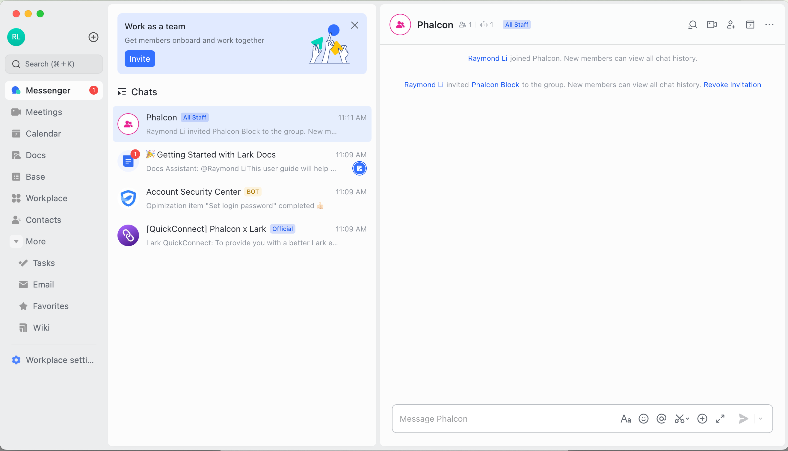
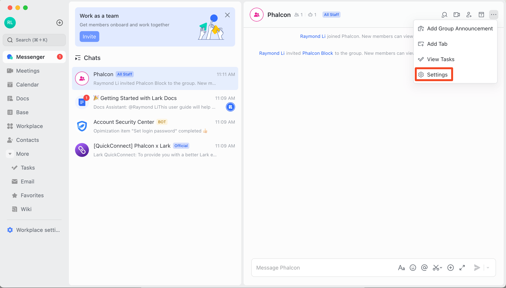
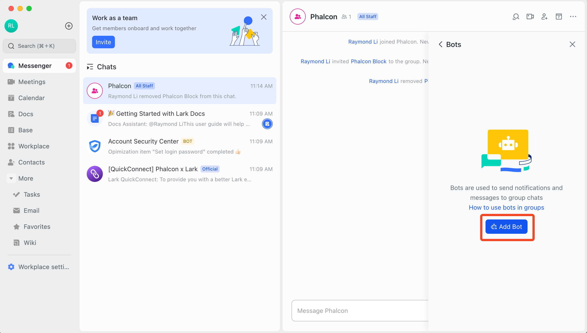
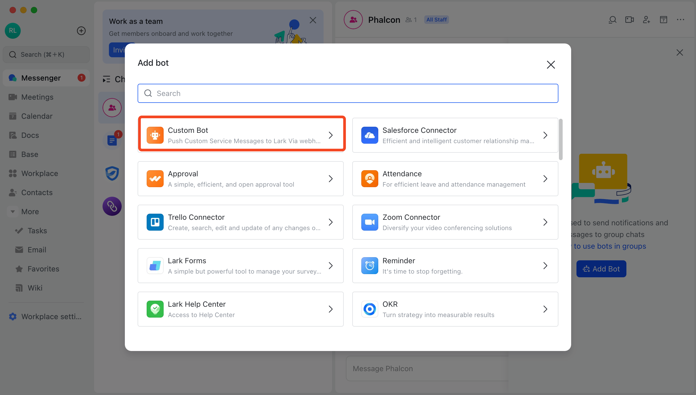
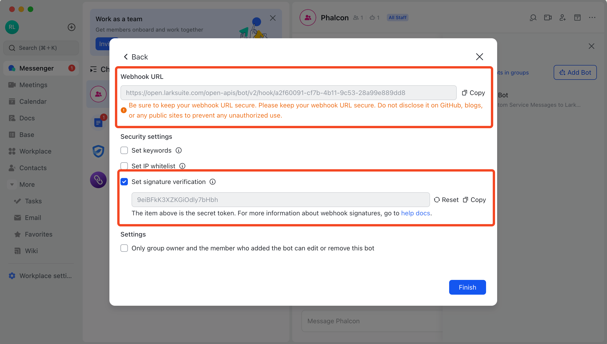
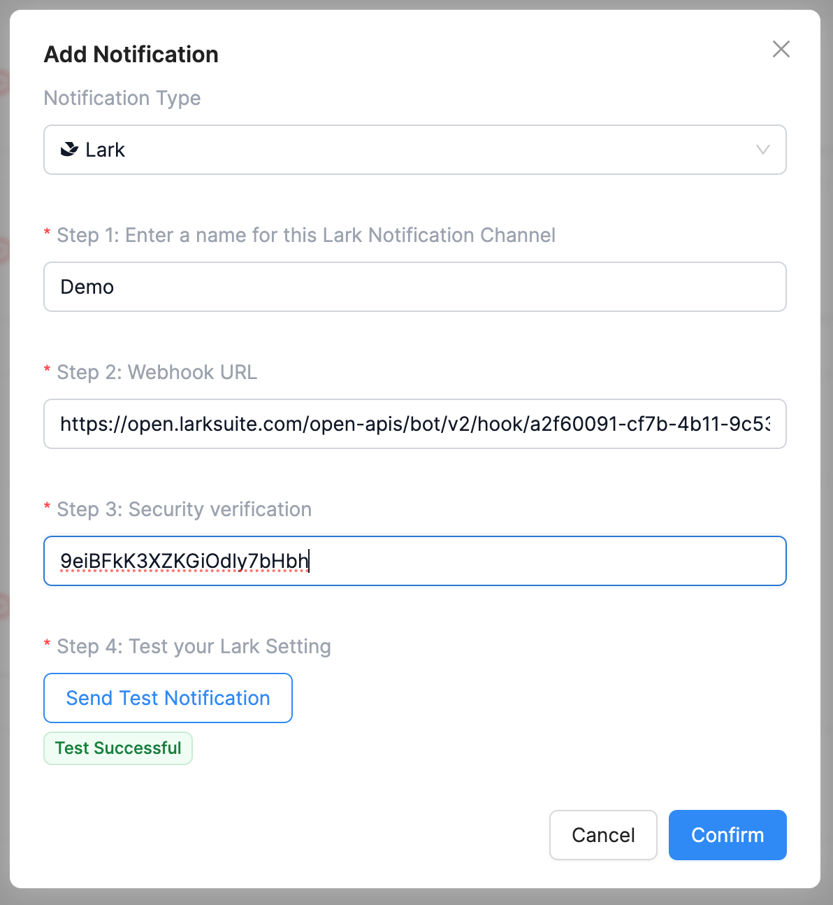
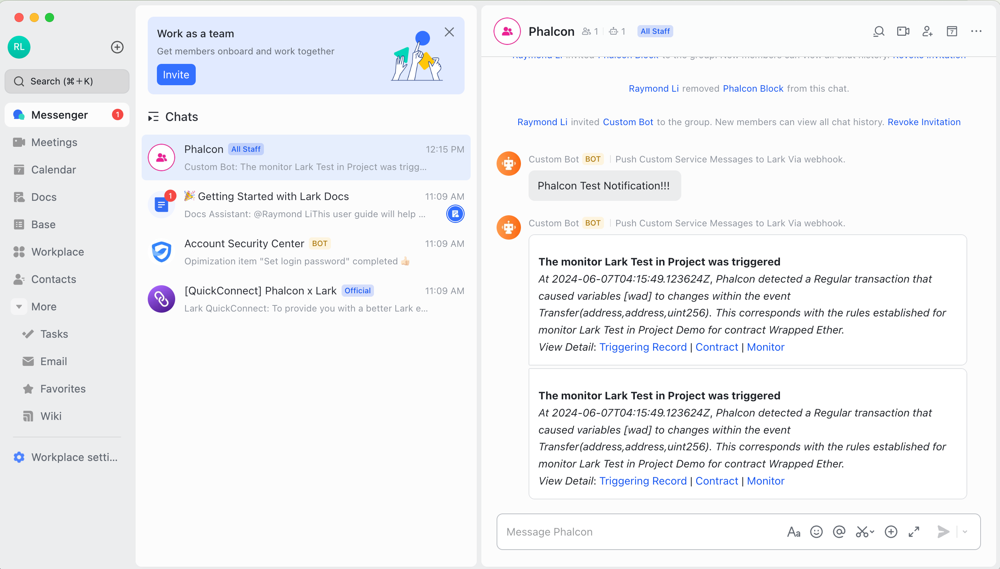

# Notification Channels

Notifications are alerts dispatched to pre-defined channels by users whenever a monitor is triggered. Phalcon Block supports a diverse range of notification methods.

## Telegram Notification Channel

To incorporate a Telegram notification channel, the platfrom offers the functionality to send notifications to a Telegram Bot.

<figure><figcaption>
Form for Constructing Telegram Notification Channels
</figcaption></figure>

For detailed instructions on adding a telegram Bot, see [this document.](how-to-setup-a-telegram-bot.md)

## Email Notification Channel

When setting up an email notification channel within Phalcon Block, it's essential to ensure that users receive alert emails accurately without disturbing other users. During the construction of the channel, a verification code is automatically dispatched to the provided email address. This code must be entered to finalize the addition of the email notification channel.

<figure><figcaption>
Form for Constructing Email Notification Channels
</figcaption></figure>

## Slack Notification Channel

To activate notifications within Slack, users can initiate the process by clicking on "Connect Slack." Subsequently, the channel is created after connecting to user's Slack account.

<figure><figcaption>
Form for Constructing Slack Notification Channels
</figcaption></figure>

## Webhook Notification Channel

Webhook is a crucial push method that allows you to build your own notification system and emergency response system. Fill out the form as prompted, and if your Webhook is set to require authentication, please enter the authentication details. To ensure the funcionality of the Webhook, you should click the "Send Test Notification" button. After the system successfully sends a test message, the setup can be completed.

<figure><figcaption>
Form for Constructing Webhook Notification Channels
</figcaption></figure>

## Lark Notification Channel

The notification from Lark involves creating a Bot within the chat. This enables Phalcon to push notifications into the chat through the Bot. The process for adding the Bot can be referred to as follows:

1. Select the chat group where you want to send notifications.

<figure><figcaption></figcaption></figure>

2. Click on the settings icon in the top right corner and select "Bot" to add.

<figure><figcaption></figcaption></figure>

<figure><figcaption></figcaption></figure>

<figure><figcaption></figcaption></figure>

<figure><figcaption></figcaption></figure>

3. Copy the Webhook URL and enable Signature Verification.

<figure><figcaption></figcaption></figure>

4. Create a Lark push notification in Phalcon and test it.

<figure><figcaption></figcaption></figure>

<figure><figcaption></figcaption></figure>
